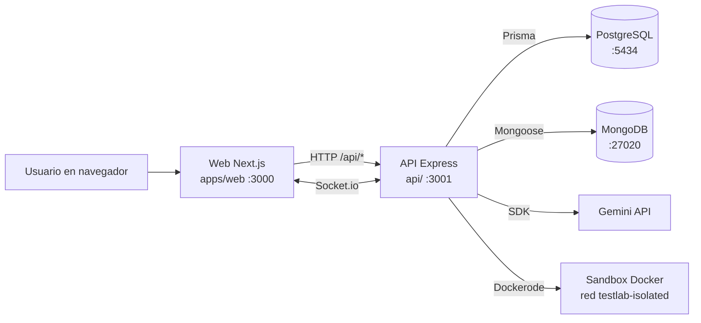
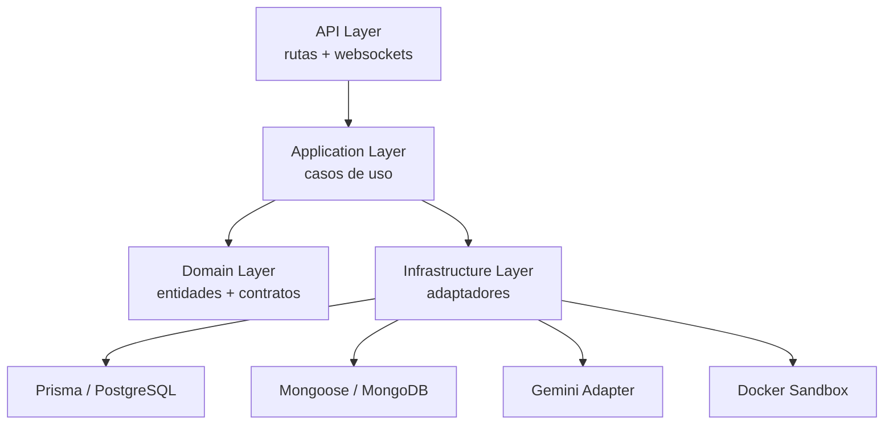
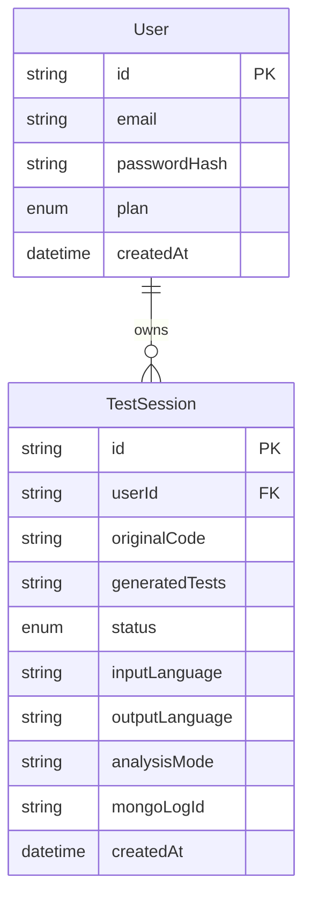
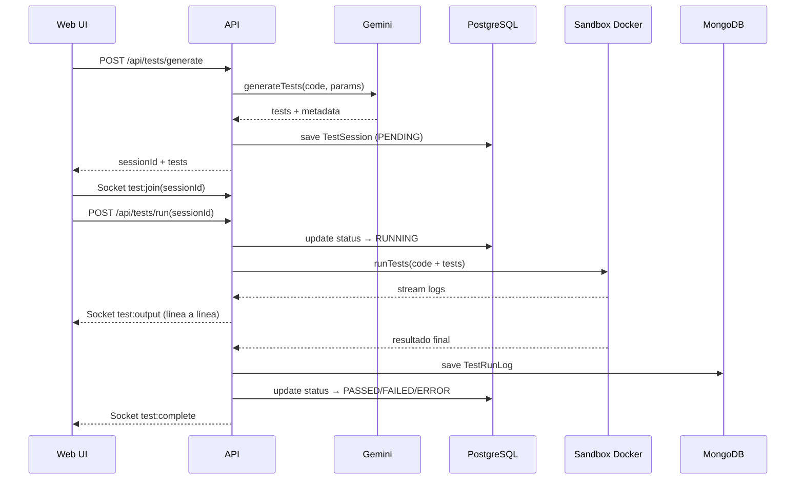

# Arquitectura del Sistema

---

## Vista de alto nivel



---

## Estructura real del repositorio

```
Test_Lab_AI/
├─ api/                      ← Backend (standalone, fuera del workspace pnpm)
│  ├─ prisma/
│  │  ├─ schema.prisma
│  │  └─ migrations/
│  ├─ src/
│  │  ├─ api/                ← Rutas HTTP y WebSockets
│  │  ├─ application/        ← Casos de uso
│  │  ├─ domain/             ← Entidades y contratos
│  │  └─ infrastructure/     ← Adaptadores externos (DB, IA, Docker)
│  ├─ Dockerfile
│  ├─ entrypoint.sh
│  └─ package.json
├─ apps/
│  └─ web/                   ← Frontend Next.js
│     ├─ app/
│     ├─ components/
│     ├─ lib/
│     ├─ Dockerfile
│     └─ package.json
├─ packages/
│  └─ shared/                ← Tipos compartidos (en crecimiento)
├─ docs/
│  ├─ INSTALLATION.md
│  ├─ APPLICATION.md
│  └─ ARCHITECTURE.md
├─ docker-compose.yml        ← Orquesta todo: DBs + API + Web
├─ .env.example              ← Plantilla de variables (se commitea)
├─ .env                      ← Variables reales (NO commitear)
└─ pnpm-workspace.yaml       ← Workspace: apps/* y packages/* (api/ es standalone)
```

> **Nota importante:** `api/` está en la raíz del repo pero NO está incluido en el workspace de pnpm (`pnpm-workspace.yaml` solo incluye `apps/*` y `packages/*`). La API gestiona sus propias dependencias con `npm`.

---

## Backend — arquitectura hexagonal



### Casos de uso principales

- **`GenerateTestsUseCase`** — recibe código, llama a Gemini, crea `TestSession` en PostgreSQL.
- **`RunTestsUseCase`** — lanza sandbox Docker, parsea output, guarda log en MongoDB, actualiza estado en PostgreSQL, emite eventos WebSocket.
- **`ChatUseCase`** — compone contexto y delega en IA para respuesta conversacional.

---

## Infraestructura Docker

```mermaid
flowchart TB
  DC[docker-compose.yml] --> PG[postgres\npostgres:16-alpine\npuerto 5434]
  DC --> MG[mongo\nmongo:7-jammy\npuerto 27020]
  DC --> API[api\nDockerfile custom\npuerto 3001]
  DC --> WEB[web\nDockerfile custom\npuerto 3000]

  API --> PG
  API --> MG
  API --> SOCK[/var/run/docker.sock\nmontado para lanzar sandboxes]

  SB[Sandboxes efímeros] -.->|red interna| ISO[testlab-isolated\nsin acceso exterior]
```

### Flujo del `entrypoint.sh` de la API

```
Contenedor arranca
  → prisma db push (sincroniza schema)
  → node dist/src/index.js (arranca Express)
```

---

## Modelo de datos

### PostgreSQL (Prisma)



Estados de `TestSession`: `PENDING` → `RUNNING` → `PASSED` / `FAILED` / `ERROR`

### MongoDB (Mongoose)

Colección `TestRunLog`:

```json
{
  "sessionId": "uuid",
  "startedAt": "datetime",
  "duration": 7810,
  "summary": "11 passed, 0 failed",
  "suites": [...],
  "rawOutput": "RUN v1.6.0 /sandbox..."
}
```

---

## Flujo end-to-end



---

## Variables de entorno por componente

| Variable | Componente | Descripción |
|----------|-----------|-------------|
| `DATABASE_URL` | API | Conexión PostgreSQL |
| `MONGODB_URI` | API | Conexión MongoDB |
| `GEMINI_API_KEY` | API | Clave Gemini para generación de tests y chat |
| `JWT_SECRET` | API | Firma de tokens JWT |
| `PORT` | API | Puerto del servidor (3001) |
| `NEXT_PUBLIC_API_URL` | Web | URL base de la API |
| `NEXT_PUBLIC_SOCKET_URL` | Web | URL para Socket.io |
| `NEXT_PUBLIC_GEMINI_API_KEY` | Web | Clave Gemini para acciones de cliente |
| `POSTGRES_USER/PASSWORD/DB` | Docker Compose | Configuración del contenedor PostgreSQL |